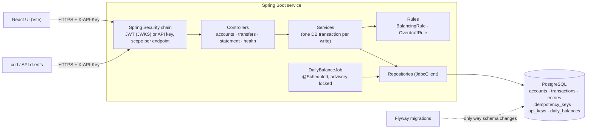
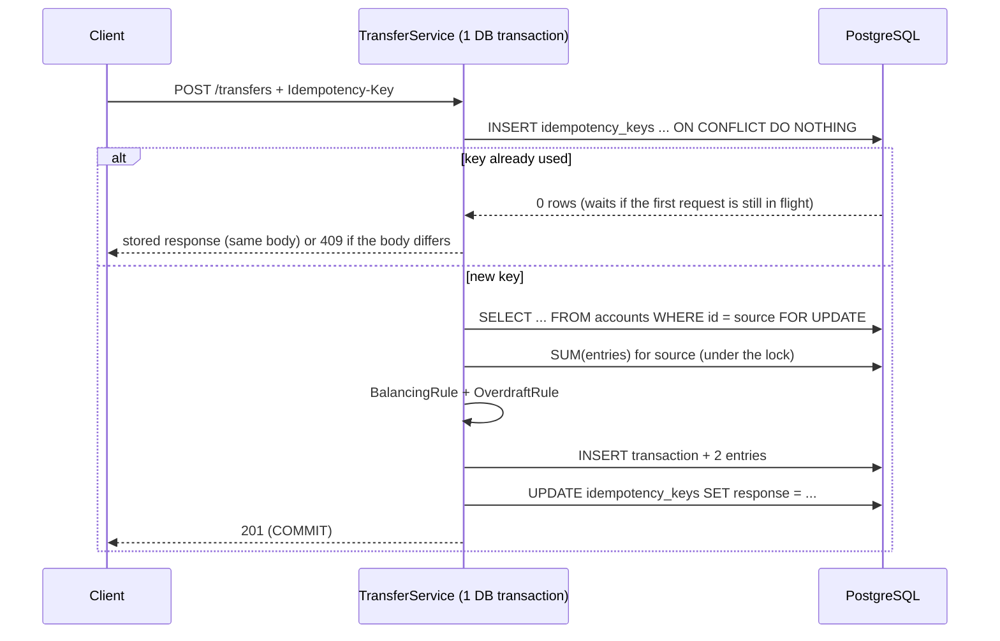

# Ledger Service

[](https://github.com/debsamanta5571-dot/ledger-service/actions/workflows/ci.yml)
[](https://github.com/debsamanta5571-dot/ledger-service/actions/workflows/codeql.yml)
[](https://github.com/debsamanta5571-dot/ledger-service/actions/workflows/dependency-scan.yml)

A double-entry ledger service: accounts, balanced transactions, idempotent transfers, and account statements,
on **Java 21 / Spring Boot 3 / PostgreSQL**. Money moves only by appending balanced entries to an immutable
journal; every balance is derived from that journal.

It is built to demonstrate the parts of ledger engineering that are easy to get wrong: the balance invariant
under concurrency, exactly-once effects for retried requests, and a schema that enforces its own rules.

- **Double entry** — every transaction's debits equal its credits; unbalanced transactions are rejected.
- **Append-only** — entries are never updated or deleted (enforced by database triggers, not just code).
- **Overdraft limits** — a transfer can never take an account below its limit, even with 50 transfers in flight.
- **Idempotent transfers** — `Idempotency-Key` header; retries return the original response, misuse returns `409`.
- **Scoped JWT auth (RS256, verified via JWKS) plus API keys with per-key rate limiting**, **RFC 7807** errors, **OpenAPI** docs at `/swagger-ui`.
- **Flyway** is the only thing that changes the schema. No ORM, no `ddl-auto`.
- Nightly **daily balance rollup**, a small **React** UI, and CI that includes CodeQL, dependency scanning, and
  an **LLM test-generation job whose output is judged by mutation testing**.

## Architecture



### What happens on `POST /transfers`



### Data model

| Table | Purpose |
| --- | --- |
| `accounts` | id, name, currency, type (`ASSET`/`LIABILITY`), `overdraft_limit` (default 0) |
| `transactions` | a posting header: id, description, timestamp |
| `entries` | **append-only** journal: transaction, account, `DEBIT`/`CREDIT`, positive amount |
| `idempotency_keys` | (client, key) → request hash + stored response |
| `api_keys` | SHA-256 of each key, per-key rate limit, active flag |
| `daily_balances` | reporting table filled by the nightly job (derived, rebuildable) |

Amounts are integers in **minor units** (cents) everywhere: `BIGINT` in the database, `long` in Java, integers in
JSON. There is no floating point in the money path.

## Run it

**Prerequisites:** JDK 21, Maven 3.9+, Docker (Testcontainers and the compose stack need it), Node 22 (UI only).

### With Docker Compose (API + Postgres)

```bash
docker compose up --build
# API:        http://localhost:8080
# Swagger UI: http://localhost:8080/swagger-ui
# UI:         http://localhost:8080/   (built into the image)
# API key:    dev-local-key   (local default; override with LEDGER_BOOTSTRAP_API_KEY)
```

Both ports are published on `127.0.0.1` only: the dev key can write and the database password is a well-known
default, so neither should be reachable from your network.

### From source

```bash
docker compose up -d db                       # just Postgres
LEDGER_BOOTSTRAP_API_KEY=dev-local-key mvn spring-boot:run
```

### UI

```bash
cd ui && npm install && npm run dev           # http://localhost:5173, proxies /api to :8080
```

### Windows desktop build (Ledger.exe)

```powershell
powershell -File scriptsuild-exe.ps1      # needs JDK 21, Maven, Node; output: distLedgerLedger.exe
docker compose up -d db                     # the exe still needs Postgres
```

`Ledger.exe` bundles its own Java runtime and the UI, listens on `127.0.0.1:8080` only, and opens your browser
(API key `dev-local-key`). If Ledger is already running it opens the existing instance; if it cannot start (for
example the database is not running) it says why and waits for Enter instead of closing.

### Tests

```bash
mvn verify            # unit + integration tests (Testcontainers starts Postgres); JaCoCo report in target/site/jacoco
cd ui && npm test     # UI unit tests
node --test "scripts/**/*.test.mjs"   # CI helper scripts
```

## Try it with curl

There is deliberately no "deposit" endpoint: value only moves between accounts. To get money into the system,
create a treasury account with a large **overdraft limit** and transfer out of it. (Amounts are cents.)

```bash
export API=http://localhost:8080 KEY=dev-local-key
H=(-H "X-API-Key: $KEY" -H "Content-Type: application/json")

# Accounts
TREASURY=$(curl -s "${H[@]}" -X POST $API/accounts \
  -d '{"name":"Treasury","currency":"USD","type":"ASSET","overdraftLimit":100000000}' | jq -r .id)
ALICE=$(curl -s "${H[@]}" -X POST $API/accounts -d '{"name":"Alice","currency":"USD","type":"ASSET"}' | jq -r .id)
BOB=$(curl -s "${H[@]}" -X POST $API/accounts -d '{"name":"Bob","currency":"USD","type":"ASSET"}' | jq -r .id)

# Fund Alice with $100.00 (10000 cents), then pay Bob $25.00. The key makes retries safe.
curl -s "${H[@]}" -X POST $API/transfers -H "Idempotency-Key: fund-alice-1" \
  -d "{\"fromAccountId\":\"$TREASURY\",\"toAccountId\":\"$ALICE\",\"amount\":10000,\"currency\":\"USD\",\"description\":\"seed\"}"

curl -s -i "${H[@]}" -X POST $API/transfers -H "Idempotency-Key: alice-pays-bob-1" \
  -d "{\"fromAccountId\":\"$ALICE\",\"toAccountId\":\"$BOB\",\"amount\":2500,\"currency\":\"USD\",\"description\":\"lunch\"}"

# Repeat the exact same request: same response, header "Idempotent-Replayed: true", no second posting.
# Same key, different amount: 409 problem+json.
curl -s -i "${H[@]}" -X POST $API/transfers -H "Idempotency-Key: alice-pays-bob-1" \
  -d "{\"fromAccountId\":\"$ALICE\",\"toAccountId\":\"$BOB\",\"amount\":9999,\"currency\":\"USD\"}"

# Overdraft protection: Alice has $75.00 left, so this is refused with 422 (insufficient-funds).
curl -s "${H[@]}" -X POST $API/transfers -H "Idempotency-Key: too-much-1" \
  -d "{\"fromAccountId\":\"$ALICE\",\"toAccountId\":\"$BOB\",\"amount\":999999,\"currency\":\"USD\"}"

# Balances and a paginated statement with running balances
curl -s "${H[@]}" $API/accounts/$ALICE
curl -s "${H[@]}" "$API/accounts/$ALICE/statement?from=2024-01-01&page=0&size=20"
```

An error response is `application/problem+json`, for example:

```json
{
  "type": "urn:ledger:problem:insufficient-funds",
  "title": "Insufficient funds",
  "status": 422,
  "detail": "Insufficient funds: 7500 available (including overdraft), 999999 requested",
  "instance": "/transfers",
  "available": 7500
}
```

### API summary

| Method & path | Notes |
| --- | --- |
| `POST /accounts` | `name`, `currency` (ISO 4217), `type`, optional `overdraftLimit` → 201 |
| `GET /accounts` / `GET /accounts/{id}` | list of open accounts (newest first, `limit` ≤ 100, `includeClosed=true` for all) / one account with derived balance |
| `DELETE /accounts/{id}` | **closes** the account: 204 (also if already closed), 409 if the balance is not zero |
| `DELETE /accounts/{id}?permanent=true` | deletes it for good: 204 only if it has **never** had a transaction, otherwise 409 |
| `GET /accounts/{id}/statement` | `from`, `to` (inclusive UTC dates), `page`, `size` ≤ 100; opening/closing balance and a running balance per entry |
| `POST /transfers` | requires `Idempotency-Key`; send from your own account to anyone's; 201 / 404 / 409 / 422 |
| `GET /health` | database connectivity; no auth |
| `/swagger-ui`, `/v3/api-docs` | OpenAPI; no auth |

Every endpoint except health and the docs requires `X-API-Key` (or a bearer token), and callers only ever see
their own accounts. Responses carry `X-RateLimit-Limit` and
`X-RateLimit-Remaining`; over the limit you get `429` with `Retry-After`.

## Design decisions and trade-offs

### Concurrency: pessimistic row lock (`SELECT … FOR UPDATE`) on the source account

I chose `SELECT … FOR UPDATE` over optimistic locking. The invariant ("balance ≥ −overdraft") depends on a
**derived** value (the sum of entries), not on a single row that a version column could guard. With optimistic
locking I would have to bump a version on the account for every transfer just to have something to conflict on,
and 50 concurrent transfers against one account would mostly abort and retry. With a row lock they queue: each
transfer waits its turn, re-reads the balance *after* it holds the lock, and either posts or is refused.
Contention becomes latency instead of retry storms, and the result is deterministic.

Details that matter:
- **Only the source account is locked.** It is the only balance a transfer can push below its limit; the
  destination only grows. It is a `FOR NO KEY UPDATE` lock, not `FOR UPDATE`: my own bidirectional concurrency
  test caught a real deadlock with plain `FOR UPDATE`, because inserting an entry for the *other* account takes a
  `FOR KEY SHARE` lock on its row (the foreign-key check), which conflicts with `FOR UPDATE` but not with
  `NO KEY UPDATE`. Transfers on one source still queue behind each other.
- **Rejected alternative: `SERIALIZABLE`.** It would also work, but needs retry logic for serialization failures
  and can abort unrelated transfers.
- **Cost:** transfers out of the *same* account are serialised, so a single very hot account limits throughput.
  Sharding a hot account into sub-accounts would be the next step. This is a deliberate correctness-first choice.
- **Proved by test:** 50 parallel transfers on one account, released simultaneously, assert exactly the right
  number succeed, the ledger balances, and the balance never dipped below its limit at any point in history.
- **Bounded waiting:** every connection sets `lock_timeout = 5s`, and the pool gives up after 10 s. A transfer
  stuck behind a hot account rolls back (its idempotency claim included) and returns a retryable `503` with
  `Retry-After`, instead of holding a thread and a connection forever. Postgres reports a lock timeout as SQL state
  `55P03`, which Spring leaves uncategorised, so the handler classifies it by SQL state (covered by a test).

### Balances are derived, never stored
`GET /accounts/{id}` computes `SUM(entries)`. There is no balance column that can drift out of sync with the
journal, and "the ledger balances" is provable with one query. The cost is an aggregate per read; a covering index
`(account_id, created_at, id) INCLUDE (direction, amount)` makes it an index-only scan. For very large accounts the
next step is checkpointing (the nightly `daily_balances` rollup is the seed of that) rather than caching a mutable
balance.

### Append-only is enforced by the database
Triggers reject `UPDATE`, `DELETE` and `TRUNCATE` on `entries`, so a bug, a psql session, or a future engineer
cannot rewrite history. Corrections are made by posting a new, opposing transaction, as in real accounting.

### Idempotency lives in the same transaction as the money movement
The key is claimed with `INSERT … ON CONFLICT DO NOTHING` as the first statement of the transfer's transaction,
and the response is stored as the last. Because it is all one transaction:
- a crash cannot leave "money moved but key not recorded" (or the reverse);
- two simultaneous requests with the same key are serialised by the unique index: the second blocks until the
  first commits, then replays its response, so exactly one posting happens;
- a **failed** transfer (422/404) rolls back its key too, so the client can fix the problem and retry the same key.
  The trade-off: failures are not cached, so a retried failure is re-evaluated.

The request is hashed from the *parsed* body (not raw bytes), so whitespace or field-order changes do not turn a
retry into a spurious `409`. Keys are scoped per API key, so one client can never replay another's response.
Not implemented: expiry of old keys (a purge job would be needed at scale).

### Account ownership
Scopes say *what kind* of thing a caller may do; ownership says *to which accounts*. Every account stores the caller
that created it: an API key's id, or `user:<subject>` for an identity-service token. Everything that reads or
changes an account (get, list, statement, close, delete, and the *source* of a transfer) matches on id **and** owner
in the SQL itself, so another customer's row is never even locked. The *destination* of a transfer may belong to
anyone, as at a real bank: you can pay into an account you cannot see.

Someone else's account returns **404, never 403**. A 403 would confirm that the id exists, which lets an attacker
probe for valid account numbers; `OwnershipIT` checks the two responses are byte-for-byte identical apart from the
id. Because an API key's id is the owner, rotating a key rewrites the secret on the same row, keeping the id, so a
rotation cannot orphan accounts. Accounts created before ownership existed were assigned to the bootstrap key by
migration V6.

### Removing an account: close it, or delete it only if it was never used
Entries are append-only, so an account is never deleted: that would break its entries' foreign keys or erase its
history. `DELETE /accounts/{id}` sets `closed_at` instead. It is refused unless the balance is exactly zero (no
stranded money); a closed account keeps its statement but is hidden from listings and cannot send or receive.

`?permanent=true` really deletes the row, but only for an account with **no entries at all** (a typo, a test
account). Nothing is lost in that case. An account with history is refused (`409 account-has-history`), even at a
zero balance, because its entries must keep saying whose they are. Deleting takes the same exclusive lock as
closing, so a transfer arriving at that moment either lands first (and the delete is refused) or finds no account
(`404`); a test races the two.

The race that matters is a transfer *into* the account landing while it is being closed. Closing takes
`FOR UPDATE`; transfers take `FOR NO KEY UPDATE` on the source and `FOR KEY SHARE` on the destination, and both
conflict with it, so a close waits for in-flight transfers and blocks new ones until it commits. Transfers never
block each other on the destination. `AccountClosingIT` races 10 transfers against 10 closes, 10 times over; with
the destination lock removed it fails every run.

### Transfer semantics
A transfer moves value from A to B in each account's own terms: an `ASSET` is credited to decrease and debited
to increase, a `LIABILITY` the opposite. Source and destination must share **currency** and **type** (an
asset-to-liability move is not a single balanced pair). Cross-currency needs FX legs and is out of scope.

### Statements
Ordered by `(created_at, id)` with a **window function** for the running balance, cut into pages afterwards so
every page shows correct balances. Trade-off: cost grows with the size of the date range, not the page number;
paging is offset-based for simple client code (keyset pagination would scale better). Entry timestamps use
`clock_timestamp()` rather than `now()`: `now()` is the transaction *start*, so a transfer that waited on a lock
would be timestamped before the one it queued behind and the statement would show an impossible running balance.

### Authentication, scopes and rate limiting
Two credential types, one authorisation table ([`SecurityConfig`](src/main/java/com/ledger/api/SecurityConfig.java)):

- **Bearer tokens** from the identity service (`Authorization: Bearer ...`). The ledger verifies them itself,
  against the identity service's **JWKS** endpoint: RS256 only (so no `alg: none` or HS256 tricks), `typ: at+jwt`
  (an ID token cannot be replayed as an access token), exact issuer, this API in `aud`, expiry. Keys are fetched
  lazily and cached; an unknown `kid` triggers a rate-limited refetch, so a key rotation upstream needs no restart.
- **API keys** (`X-API-Key`), kept for machine callers. Keys carry no per-key scopes, so every key gets
  `ledger.auth.api-key-scopes`, which defaults to **read-only** (`accounts:read`, `transfers:read`). Writes need a
  scoped token. (The local `docker-compose.yml` overrides this so the curl walkthrough below works.)

Each endpoint declares the scope it needs, and anything not listed is denied:

| Endpoint | Scope |
| --- | --- |
| `GET /accounts`, `GET /accounts/{id}` | `accounts:read` |
| `POST /accounts` | `accounts:write` |
| `GET /accounts/{id}/statement` | `transfers:read` |
| `POST /transfers` | `transfers:write` |

Read and write scopes are separate on purpose: a token with `transfers:write` cannot list accounts, and one with
`accounts:read` cannot move money. A valid token without the scope gets `403` (`insufficient_scope`), a missing or
invalid one `401`, both as problem+json.

I moved from a hand-written filter to Spring Security once there were two credential types and scopes to enforce:
verifying JWTs and their key rotation is exactly the code not to write by hand. The API-key filter now runs inside
that chain. Idempotency keys are scoped per caller (API key id, or `user:<subject>` for tokens).

API keys are stored only as SHA-256 hashes (they are long random secrets, so a slow password hash buys nothing).
Rate limiting applies to API keys: an in-memory **token bucket per key**, fast and dependency-free, but each instance
counts separately, so behind N replicas the effective limit is up to N× (a global limit needs Redis or a database
counter). Token callers are not limited by this service; that belongs at the gateway, as do unauthenticated attempts.

### Plain SQL instead of an ORM
`JdbcClient` with explicit SQL: the locking, window functions and `ON CONFLICT` semantics are the point of this
project, and an ORM would hide exactly the parts worth reading. No `ddl-auto`; Flyway migrations are the schema.

### Nightly rollup
`daily_balances` (per account, per active UTC day) is filled by an in-process `@Scheduled` job. It is idempotent
(`ON CONFLICT DO UPDATE`), self-healing (each run processes every missing day since the last), and safe with many
instances thanks to a Postgres advisory lock. It is derived data: nothing in the posting path reads it.

### Testing
`LedgerIntegrityIT` fires 200 random concurrent requests (transfers, reused idempotency keys, doomed
requests, close attempts) and then checks every invariant over the journal: each transaction balances with one
debit and one credit, money is conserved, no account ever went below its limit, every idempotency record points at
a real transaction, and no closed account holds money.

Integration tests run against real Postgres via Testcontainers (a mock database cannot tell you whether a row lock
works). Unit tests cover the balancing rule, the overdraft rule and the transfer service in isolation. CI runs
build/test with JaCoCo coverage, CodeQL, dependency review and Trivy, and builds the Docker image.

### LLM-generated tests, judged by mutation testing
On PRs that change main code, a workflow asks an LLM for unit tests, keeps only those that **compile and pass**,
reports the **coverage delta**, then runs **PIT** to show which generated tests actually kill mutants. Coverage
alone rewards tests that execute code without checking it; mutation testing exposes those. Safety: model output is
untrusted code, so the job holding the API key never executes it, generated code is scanned for forbidden
constructs, and the job that runs it has no secrets. A generated test that *fails* is reported, not silently
dropped: it is either a bad test or a real bug. See `scripts/llm-testgen/`.

## Known limitations / next steps

- Ownership is per caller (one API key, or one identity-service user). There is no sharing, no joint accounts and
  no organisation-level access; those would need an owner *group* rather than a single owner id.
- No deposit/withdrawal against the outside world; fund accounts through an overdraft-enabled treasury account.
- Single currency per transfer; no FX. `ASSET`/`LIABILITY` only (no equity/revenue/expense).
- Statement pagination is offset-based; very large date ranges would want keyset pagination or checkpoints.
- Rate limiter and API-key lookups are per-instance / per-request; use Redis and a short-lived cache at scale.
- Access tokens are verified offline, so revoking a session upstream does not stop tokens already issued; they
  expire within minutes (the identity service issues 10-minute access tokens). Introspection would close that gap
  at the cost of a network call per request.
- Idempotency keys are never expired.
- `POST /accounts` is not idempotent, so a double-submitted create makes two accounts.
- Unknown routes and unsupported methods return `403` rather than `404`/`405`, because anything not listed in
  `SecurityConfig` is denied before routing. That keeps new endpoints closed by default, at the cost of less precise
  status codes.
- Reversals/corrections are done by posting new transactions; there is no dedicated reversal endpoint.

## Deployment

CI is in `.github/workflows/`. For Azure Container Apps see [docs/deploy-azure.md](docs/deploy-azure.md).

## Repository layout

```
src/main/java/com/ledger/
  account/    accounts: controller, service, repository, DTOs
  transfer/   transfers + idempotency
  ledger/     the pure rules: BalancingRule, OverdraftRule
  statement/  statement endpoint
  reporting/  nightly daily_balances job
  api/        auth filter, rate limiter, RFC 7807 handler, OpenAPI config
src/main/resources/db/migration/   Flyway migrations (V1 schema, V2 keys + indexes, V3 daily_balances)
ui/                                React + Vite UI
scripts/                           coverage summary + LLM test-generation pipeline (with its own tests)
.github/workflows/                 ci, codeql, dependency-scan, llm-tests
```
