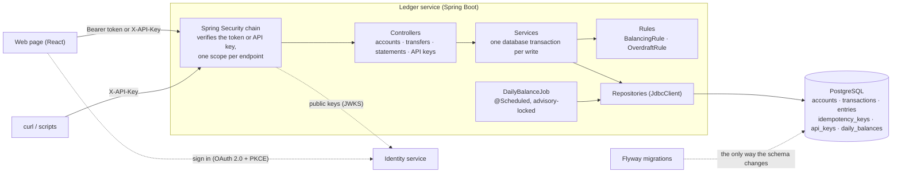

# Ledger Service

[](https://github.com/debsamanta5571-dot/ledger-service/actions/workflows/ci.yml)
[](https://github.com/debsamanta5571-dot/ledger-service/actions/workflows/codeql.yml)
[](https://github.com/debsamanta5571-dot/ledger-service/actions/workflows/dependency-scan.yml)

A double-entry ledger service built with **Java 21, Spring Boot 3 and PostgreSQL**. It manages accounts, balanced
transactions, idempotent transfers and account statements. Money moves only by appending balanced entries to an
immutable journal, and every balance is derived from that journal.

The project focuses on the parts of ledger engineering that are easy to get wrong: keeping balances correct under
concurrency, making retried requests take effect exactly once, controlling who may touch which account, and a
database schema that enforces its own rules.

- **Double entry.** Every transaction's debits equal its credits; unbalanced transactions are rejected.
- **Append-only history.** Entries are never updated or deleted, and database triggers enforce this, not just code.
- **Overdraft limits.** A transfer can never take an account below its limit, even with 50 transfers in flight.
- **Idempotent transfers.** Send an `Idempotency-Key` header: a retry returns the original response, and reusing a
  key for a different request returns `409`.
- **Accounts belong to people.** Normal users act only on their own accounts; admins can act on every account, and
  every transaction records who initiated it.
- **Sign-in through a companion identity service** (OAuth 2.0 with PKCE), plus personal and service **API keys**
  with per-key rate limiting.
- **Errors as RFC 7807 problem+json**, and **OpenAPI** docs at `/swagger-ui`.
- **Flyway** is the only thing that changes the schema: no ORM, no `ddl-auto`.
- A nightly **daily-balance rollup**, a **React** web page, a Windows **desktop build**, and CI with CodeQL,
  dependency scanning and an **LLM test-generation job whose output is judged by mutation testing**.

## Architecture



### What happens on `POST /transfers`

```mermaid
sequenceDiagram
    participant Client
    participant API as TransferService (one database transaction)
    participant DB as PostgreSQL

    Client->>API: POST /transfers + Idempotency-Key
    API->>DB: INSERT INTO idempotency_keys ... ON CONFLICT DO NOTHING
    alt key already used
        DB-->>API: 0 rows (waits if the first request is still in flight)
        API-->>Client: the stored response, or 409 if the request differs
    else new key
        API->>DB: lock the source account (FOR NO KEY UPDATE; yours, unless you are an admin)
        API->>DB: lock the destination account (FOR KEY SHARE; anyone's)
        API->>DB: SUM(entries) for the source, read under the lock
        API->>API: BalancingRule + OverdraftRule
        API->>DB: INSERT the transaction (recording who initiated it) + 2 entries
        API->>DB: UPDATE idempotency_keys SET the stored response
        API-->>Client: 201 (COMMIT)
    end
```

### Data model

| Table | Purpose |
| --- | --- |
| `accounts` | name, currency, type (`ASSET`/`LIABILITY`), overdraft limit, owner, and `closed_at` once closed |
| `transactions` | a posting header: description, timestamp, and who initiated it |
| `entries` | the **append-only** journal: transaction, account, `DEBIT`/`CREDIT`, positive amount |
| `idempotency_keys` | (caller, key) → request hash and stored response |
| `api_keys` | SHA-256 of each key, its owner and scopes (personal keys), rate limit, active flag |
| `daily_balances` | reporting table filled by the nightly job (derived and rebuildable) |

Amounts are integers in **minor units** (cents) everywhere: `BIGINT` in the database, `long` in Java and integers in
JSON. There is no floating point anywhere in the money path.

## Running it

**Prerequisites:** JDK 21, Maven 3.9+, Docker (for Testcontainers and the compose stack), and Node 22 (for the web
page only).

### With Docker Compose (service + Postgres)

```bash
docker compose up --build
# Web page:   http://localhost:8080/
# Swagger UI: http://localhost:8080/swagger-ui
# API key:    dev-local-key   (local default; override it with LEDGER_BOOTSTRAP_API_KEY)
```

Both ports are published on `127.0.0.1` only. The dev key can write, and the database password is a well-known
default, so neither should be reachable from your network.

### From source

```bash
docker compose up -d db                                        # Postgres only
LEDGER_BOOTSTRAP_API_KEY=dev-local-key mvn spring-boot:run
cd ui && npm install && npm run dev                            # web page at http://localhost:5173
```

### Signing in with the identity service

The web page's **Sign in** button uses the companion [identity service](../identity-service) (OAuth 2.0
authorization code flow with PKCE). Run it next to the ledger:

```bash
cd ../identity-service && ./scripts/dev-secrets.sh    # once: generates .env, including the local admin login
docker compose up -d identity-api                     # http://localhost:5001
```

The identity service registers the web page as the `ledger-ui` client, with the redirect URIs
`http://127.0.0.1:8080/`, `http://localhost:8080/` and `http://localhost:5173/`. Sign in with the admin account
from its `.env`, or with any user created in its admin console. What a user may do depends on their role:
`operator` users manage their own accounts and send money, `auditor` users can only read, and `admin` users can act
on every account. **Use an API key instead** still works for scripts and for running without the identity service.

### Windows desktop build (`Ledger.exe`)

```powershell
powershell -File scripts\build-exe.ps1      # needs JDK 21, Maven and Node; output: dist\Ledger\Ledger.exe
docker compose up -d db                     # the exe still needs Postgres
```

`Ledger.exe` bundles its own Java runtime and the web page, listens on `127.0.0.1:8080` only, and opens your
browser (API key `dev-local-key`). If Ledger is already running, it opens the existing instance. If it cannot start,
for example because the database is not running, it explains why and waits for Enter instead of closing.

### Tests

```bash
mvn verify                            # unit + integration tests (Testcontainers starts Postgres); JaCoCo report in target/site/jacoco
cd ui && npm test                     # web page unit tests
node --test "scripts/**/*.test.mjs"   # CI helper scripts
```

## Trying it with curl

There is deliberately no "deposit" endpoint: value only moves between accounts. To bring money into the system,
create a treasury account with a large **overdraft limit** and transfer out of it. Amounts are in cents.

```bash
export API=http://localhost:8080 KEY=dev-local-key
H=(-H "X-API-Key: $KEY" -H "Content-Type: application/json")

# Accounts
TREASURY=$(curl -s "${H[@]}" -X POST $API/accounts \
  -d '{"name":"Treasury","currency":"USD","type":"ASSET","overdraftLimit":100000000}' | jq -r .id)
ALICE=$(curl -s "${H[@]}" -X POST $API/accounts -d '{"name":"Alice","currency":"USD","type":"ASSET"}' | jq -r .id)
BOB=$(curl -s "${H[@]}" -X POST $API/accounts -d '{"name":"Bob","currency":"USD","type":"ASSET"}' | jq -r .id)

# Fund Alice with $100.00 (10000 cents), then pay Bob $25.00. The Idempotency-Key makes retries safe.
curl -s "${H[@]}" -X POST $API/transfers -H "Idempotency-Key: fund-alice-1" \
  -d "{\"fromAccountId\":\"$TREASURY\",\"toAccountId\":\"$ALICE\",\"amount\":10000,\"currency\":\"USD\",\"description\":\"seed\"}"

curl -s -i "${H[@]}" -X POST $API/transfers -H "Idempotency-Key: alice-pays-bob-1" \
  -d "{\"fromAccountId\":\"$ALICE\",\"toAccountId\":\"$BOB\",\"amount\":2500,\"currency\":\"USD\",\"description\":\"lunch\"}"

# Sending the exact same request again returns the same response with "Idempotent-Replayed: true", and nothing is
# posted twice. The same key with a different amount returns 409 problem+json:
curl -s -i "${H[@]}" -X POST $API/transfers -H "Idempotency-Key: alice-pays-bob-1" \
  -d "{\"fromAccountId\":\"$ALICE\",\"toAccountId\":\"$BOB\",\"amount\":9999,\"currency\":\"USD\"}"

# Overdraft protection: Alice has $75.00 left, so this is refused with 422 (insufficient-funds).
curl -s "${H[@]}" -X POST $API/transfers -H "Idempotency-Key: too-much-1" \
  -d "{\"fromAccountId\":\"$ALICE\",\"toAccountId\":\"$BOB\",\"amount\":999999,\"currency\":\"USD\"}"

# Balance, and paginated statements with a running balance
curl -s "${H[@]}" $API/accounts/$ALICE
curl -s "${H[@]}" "$API/accounts/$ALICE/statements?from=2024-01-01&page=0&size=20"
```

Errors are returned as `application/problem+json`, for example:

```json
{
  "type": "urn:ledger:problem:insufficient-funds",
  "title": "Insufficient funds",
  "status": 422,
  "detail": "Insufficient funds: 7500 available (including overdraft), 999999 requested",
  "instance": "/transfers",
  "available": 7500
}
```

### API summary

| Method and path | Notes |
| --- | --- |
| `POST /accounts` | `name`, `currency` (ISO 4217), `type`, optional `overdraftLimit` → 201. Admins may add `ownerId` to open it for someone else. |
| `GET /accounts` | your open accounts, newest first (`limit` ≤ 100; `includeClosed=true` adds closed ones; admins see everyone's unless `mine=true`) |
| `GET /accounts/{id}` | one account with its derived balance |
| `GET /accounts/{id}/statements` | `from`, `to` (inclusive UTC dates), `page`, `size` ≤ 100; opening and closing balances, plus a running balance per entry |
| `DELETE /accounts/{id}` | **closes** the account: 204 (also if it was already closed), or 409 if its balance is not zero |
| `DELETE /accounts/{id}?permanent=true` | deletes it for good: 204 only if it **never** had a transaction, otherwise 409 |
| `POST /transfers` | requires `Idempotency-Key`; sends from your own account to anyone's; 201, 404, 409 or 422 |
| `POST /api-keys`, `GET /api-keys`, `DELETE /api-keys/{id}` | create (the secret is shown once), list and revoke personal API keys |
| `GET /health` | database connectivity; no authentication |
| `GET /ui-config` | where the web page signs in; no authentication |
| `/swagger-ui`, `/v3/api-docs` | OpenAPI documentation; no authentication |

Every other endpoint needs a bearer token or an `X-API-Key`. API-key responses carry `X-RateLimit-Limit` and
`X-RateLimit-Remaining`; over the limit, the response is `429` with `Retry-After`.

## Design decisions and trade-offs

### Concurrency: pessimistic row locks

I chose row locks (`SELECT … FOR NO KEY UPDATE`) over optimistic locking. The invariant, "balance ≥ −overdraft
limit", depends on a **derived** value (the sum of entries), not on a single row that a version column could
guard. With optimistic locking, every transfer would have to bump a version on the account just to create
something to conflict on, and 50 concurrent transfers against one account would mostly abort and retry. With a row
lock they queue instead: each transfer waits its turn, re-reads the balance *after* it holds the lock, and then
either posts or is refused. Contention turns into latency rather than retry storms, and the outcome is deterministic.

The details that matter:

- **The source account gets `FOR NO KEY UPDATE`.** It is the only balance a transfer can push below its limit, so
  transfers out of the same account queue behind each other. It is deliberately not `FOR UPDATE`: my bidirectional
  concurrency test caught a real deadlock with `FOR UPDATE`, because inserting an entry for the *other* account
  takes a `FOR KEY SHARE` lock on its row (the foreign-key check), which conflicts with `FOR UPDATE` but not with
  `FOR NO KEY UPDATE`.
- **The destination account gets `FOR KEY SHARE`.** That lock stops the account from being closed mid-transfer
  (see below) but blocks no other transfer, and it does not conflict with the source lock, so opposite transfers
  (A to B and B to A) cannot deadlock.
- **Rejected alternative: `SERIALIZABLE`.** It would also work, but it needs retry logic for serialization failures
  and can abort unrelated transfers.
- **Cost.** Transfers out of the *same* account are serialized, so one very hot account limits throughput.
  Splitting a hot account into sub-accounts would be the next step. This is a deliberate correctness-first choice.
- **Proven by tests.** Fifty parallel transfers on one account, released at the same instant, must produce exactly
  the right number of successes, a balanced ledger, and a balance that never dipped below its limit at any point.
- **Bounded waiting.** Every connection sets `lock_timeout = 5s`, and the connection pool gives up after 10 seconds.
  A transfer stuck behind a hot account rolls back (including its idempotency claim) and returns a retryable `503`
  with `Retry-After`, instead of holding a thread and a connection indefinitely. Postgres reports a lock timeout as
  SQL state `55P03`, which Spring leaves uncategorized, so the error handler classifies it by SQL state (tested).

### Balances are derived, never stored

`GET /accounts/{id}` computes `SUM(entries)`. There is no balance column that could drift out of sync with the
journal, and "the ledger balances" can be proven with a single query. The cost is an aggregate on every read; a
covering index on `(account_id, created_at, id) INCLUDE (direction, amount)` turns it into an index-only scan. For
very large accounts, the next step would be checkpoints (the nightly `daily_balances` rollup is the seed of one),
not a cached, mutable balance.

### The database enforces append-only history

Triggers reject `UPDATE`, `DELETE` and `TRUNCATE` on `entries`, so no bug, `psql` session or future engineer can
rewrite history. Mistakes are corrected by posting a new, opposing transaction, as in real accounting.

### Idempotency lives in the same transaction as the money movement

The key is claimed with `INSERT … ON CONFLICT DO NOTHING` as the first statement of the transfer's database
transaction, and the response is stored as the last. Because it is all one transaction:

- a crash cannot leave "money moved but key not recorded", or the reverse;
- two simultaneous requests with the same key are serialized by the unique index: the second waits until the first
  commits, then replays its response, so exactly one posting happens;
- a **failed** transfer (422 or 404) rolls back its key too, so the client can fix the problem and retry with the
  same key. The trade-off is that failures are not cached, so a retried failure is evaluated again.

The request is hashed from the *parsed* body, not the raw bytes, so a change in whitespace or field order does not
turn a genuine retry into a spurious `409`. Keys are scoped per caller, so one caller can never replay another's
response. Old keys are never expired; at scale, a purge job would be needed.

### Access control: scopes, ownership and two tiers

**Scopes** say what *kind* of thing a caller may do. Each endpoint declares the scope it needs in one table
([`SecurityConfig`](src/main/java/com/ledger/api/SecurityConfig.java)), and anything not listed is denied:

| Endpoint | Scope |
| --- | --- |
| `GET /accounts`, `GET /accounts/{id}`, `GET /api-keys` | `accounts:read` |
| `POST /accounts`, `DELETE /accounts/{id}`, `POST /api-keys`, `DELETE /api-keys/{id}` | `accounts:write` |
| `GET /accounts/{id}/statements` | `transfers:read` |
| `POST /transfers` | `transfers:write` |

Read and write scopes are separate on purpose: a token with `transfers:write` cannot list accounts, and one with
`accounts:read` cannot move money. A valid credential without the scope gets `403` (`insufficient_scope`); a missing
or invalid one gets `401`. Both are problem+json.

**Ownership** says *which accounts* a caller may touch. Every account records the caller that created it: a user
(`user:<subject>` from their token) or an API key. Everything that reads or changes an account (get, list,
statements, close, delete, and the *source* of a transfer) filters on the owner inside the SQL itself, so another
customer's row is never even locked. The *destination* of a transfer may belong to anyone, as at a real bank: you
can pay into an account you cannot see.

Someone else's account returns **404, never 403**. A 403 would confirm that the account exists, which would let an
attacker probe for valid account numbers. `OwnershipIT` checks that the two responses are identical apart from the
ID.

**Two tiers.** Normal users act only on their own accounts. **Admins** hold the `ledger:admin` scope, which the
identity service grants only to its `admin` role. They see every account along with its owner's name, read any
account's statements, send money from any account, and close or delete any account. In the web page they get an
*Admin* badge, an *Owner* column and an *Only mine* filter. The access rule is a single SQL predicate,
`(owner_id = :caller OR :admin)`, shared by every lookup, so the two tiers cannot drift apart between endpoints.

Being an admin grants *reach*, not an exemption from the ledger's rules: an admin still cannot overdraw an account,
strand money by closing a funded account, or delete an account that has history.

**Accountability.** Every transaction records who initiated it, and statements show that in a *By* column, so a
customer can see by name when an admin moved their money. Admin actions on someone else's account are also logged.
The name comes from the access token's `name` claim, which the identity service includes only when the `profile`
scope is granted. Email addresses are never put into access tokens.

### Authentication: tokens and API keys

**Bearer tokens** from the identity service (`Authorization: Bearer …`) are verified by the ledger itself, against
the identity service's **JWKS** endpoint. It accepts RS256 only (ruling out `alg: none` and HS256 tricks), requires
`typ: at+jwt` (so an ID token cannot be replayed as an access token), and checks the exact issuer, this API in
`aud`, and the expiry. Keys are fetched lazily and cached; an unknown `kid` triggers a rate-limited refetch, so a
key rotation on the identity side needs no restart here. Access tokens last 10 minutes: the ledger verifies them
offline, so it cannot see a revoked token, and the short lifetime bounds that window.

**API keys** (`X-API-Key`) come in two kinds:

- **Service keys**, such as the bootstrap key, act as themselves with the scopes in `ledger.auth.api-key-scopes`
  (read-only by default; the local `docker-compose.yml` grants write access so the curl walkthrough works).
- **Personal keys** act *as their owner*: the same accounts, attributed to them ("Kay (API key)" on statements).
  Only a signed-in person can create one, never another key, so a leaked key cannot be used to mint replacements.
  A personal key never carries `ledger:admin`, because admin power requires an interactive sign-in, even when an
  admin created the key. Only an admin can create a key for someone else.

Keys are stored only as SHA-256 hashes (they are long random secrets, so a slow password hash would buy nothing),
and personal keys start with `lk_` so a leaked one is easy to recognize. Rotating the bootstrap key rewrites the
secret on the same row, so the key keeps its identity and cannot orphan the accounts it owns. Rotation only ever
touches keys that have no owner, so a personal key that someone named "bootstrap" cannot be hijacked by it.

**Rate limiting** applies to API keys: an in-memory **token bucket per key**, fast and dependency-free. Each
instance counts separately, though, so behind N replicas the effective limit is up to N times higher; a global
limit would need Redis or a database counter. Token callers and unauthenticated attempts are not limited by this
service; that belongs at the gateway.

I moved from a hand-written filter to Spring Security once there were two credential types and scopes to enforce:
verifying JWTs, and handling their key rotation, is exactly the kind of code not to write by hand. The API-key
filter now runs inside that chain.

### The web page's sign-in

- **No secret in the browser.** As a public client, the page proves itself with PKCE: a random verifier is hashed
  into the authorization request, and only this browser can present the original when exchanging the code.
- **Tokens stay in memory.** Nothing that grants access is written to storage, where an XSS bug could read it.
  After a reload, the page repeats the sign-in redirect, which the identity service answers instantly from its own
  session, so there is no second password prompt.
- **One refresh at a time.** The identity service treats a reused refresh token as theft and ends the session, so
  parallel requests share a single refresh (unit-tested with five concurrent callers).
- **Signing out** revokes the refresh token and ends the identity-service session.
- **One place to configure.** The page learns where to sign in from `GET /ui-config`, so the identity service's
  address is configured once, on the server (`IDENTITY_ISSUER`).
- **Trade-off:** the page also requests `users:admin`, which only admins receive, so that the **New account**
  dialog can create sign-in accounts. An admin's page token can therefore manage users for its 10-minute life. A
  separate step-up sign-in just for that action would keep the power out of routine tokens, at the cost of a
  second redirect.

### The New account dialog

**+ New account** opens a dialog that always opens a ledger account and can, in the same step:

- **create a sign-in account** for a new person (admins only): email, name, role, and a typed or generated
  password. The ledger account is then opened *for that person* (`POST /accounts` with `ownerId`);
- **generate a personal API key** for the account's owner, for use in scripts.

Secrets are shown once, on the result screen, with copy buttons, and the page never stores them. If a later step
fails, the dialog reports what has already succeeded, so retrying does not create anything twice.

### Removing an account: close it, or delete it only if it was never used

Entries are append-only, so an account with history is never deleted: that would break its entries' foreign keys
or erase who they belong to. `DELETE /accounts/{id}` sets `closed_at` instead. It is refused unless the balance is
exactly zero, so no money is stranded. A closed account keeps its statements but is hidden from listings and can no
longer send or receive money.

`?permanent=true` really deletes the row, but only for an account with **no entries at all**, such as a typo or a
test account, where nothing is lost. An account with history is refused (`409 account-has-history`) even at a zero
balance.

The race that matters is a transfer landing *in* an account while it is being closed. Closing takes `FOR UPDATE`,
which conflicts with both transfer locks, so a close waits for in-flight transfers and blocks new ones until it
commits. `AccountClosingIT` races 10 transfers against 10 closes, ten times over; with the destination lock
removed, it fails every run. Permanent deletion takes the same lock, and a separate test races it against incoming
transfers.

### Transfer semantics

A transfer moves value from A to B in each account's own terms: an `ASSET` account decreases with a credit and
increases with a debit, and a `LIABILITY` account the opposite. The source and destination must share a
**currency** and a **type**, because an asset-to-liability move is not a single balanced pair. Cross-currency
transfers would need FX legs and are out of scope.

### Statements

Entries are ordered by `(created_at, id)`, and a **window function** computes the running balance before the
results are cut into pages, so every page shows correct balances. The trade-off is that cost grows with the size
of the date range rather than the page number, and paging is offset-based for simple client code; keyset
pagination would scale better. Entry timestamps use `clock_timestamp()` rather than `now()`: `now()` is the
*start* of the database transaction, so a transfer that waited on a lock would be stamped earlier than the one it
queued behind, and the statements would show an impossible running balance.

### Plain SQL instead of an ORM

The service uses `JdbcClient` with explicit SQL. The locking, window functions and `ON CONFLICT` behavior are the
point of this project, and an ORM would hide exactly the parts worth reading. There is no `ddl-auto`: the Flyway
migrations are the schema.

### Nightly rollup

An in-process `@Scheduled` job fills `daily_balances` (one row per account per active UTC day). It is idempotent
(`ON CONFLICT DO UPDATE`), self-healing (each run processes every day missed since the last one), and safe with
many instances thanks to a Postgres advisory lock. It is derived data: nothing in the posting path reads it.

### Testing

Integration tests run against real Postgres through Testcontainers, because a mock database cannot tell you whether
a row lock works. Unit tests cover the balancing rule, the overdraft rule and the transfer service in isolation.

`LedgerIntegrityIT` fires 200 random concurrent requests (transfers, reused idempotency keys, requests that must
fail, and close attempts), then checks every invariant over the journal: each transaction balances with exactly
one debit and one credit, money is conserved, no account ever went below its limit, every idempotency record points
at a real transaction, and no closed account holds money.

CI builds and tests with JaCoCo coverage, runs CodeQL, dependency review and Trivy, and builds the Docker image.

### LLM-generated tests, judged by mutation testing

On pull requests that change main code, a workflow asks an LLM for unit tests, keeps only those that **compile and
pass**, reports the **coverage delta**, and then runs **PIT** to show which generated tests actually kill mutants.
Coverage alone rewards tests that execute code without checking anything; mutation testing exposes them.

Model output is treated as untrusted code: the job that holds the API key never executes it, generated code is
scanned for forbidden constructs, and the job that runs it has no secrets. A generated test that *fails* is
reported rather than silently dropped, because it is either a bad test or a real bug. See `scripts/llm-testgen/`.

## Known limitations and next steps

- Each account has a single owner (one user or one API key). There is no sharing, no joint accounts and no
  organization-level access; those would need an owner *group* instead of a single owner ID. The admin tier is
  all-or-nothing: there is no "admin for one branch".
- There is no deposit or withdrawal against the outside world; fund accounts through an overdraft-enabled treasury
  account.
- Transfers use a single currency (no FX), and accounts are `ASSET` or `LIABILITY` only (no equity, revenue or
  expense).
- Statement pagination is offset-based; very large date ranges would call for keyset pagination or checkpoints.
- The rate limiter is per instance, and API keys are looked up on every request; at scale, use Redis and a
  short-lived cache.
- Access tokens are verified offline, so revoking a session in the identity service does not stop tokens already
  issued; they expire within 10 minutes. Token introspection would close that gap at the cost of a network call per
  request.
- Idempotency keys are never expired.
- `POST /accounts` is not idempotent, so a double-submitted create makes two accounts.
- A personal API key keeps working if its owner is deactivated in the identity service; it must be revoked
  separately.
- Unknown routes and unsupported methods return `403` rather than `404` or `405`, because anything not listed in
  `SecurityConfig` is denied before routing. That keeps new endpoints closed by default, at the cost of less precise
  status codes.
- Corrections are made by posting new transactions; there is no dedicated reversal endpoint.

## Deployment

The CI workflows are in `.github/workflows/`. For Azure Container Apps, see
[docs/deploy-azure.md](docs/deploy-azure.md).

## Repository layout

```
src/main/java/com/ledger/
  account/     accounts: controller, service, repository, DTOs
  transfer/    transfers and idempotency
  ledger/      the pure rules: BalancingRule, OverdraftRule
  statement/   the statements endpoint
  reporting/   the nightly daily_balances job
  api/         security (tokens, API keys, scopes), rate limiter, RFC 7807 errors, OpenAPI, /ui-config
src/main/resources/db/migration/   Flyway migrations V1 to V8 (schema, keys and indexes, rollup, limits,
                                   closing, ownership, admin audit trail, personal API keys)
ui/                                React + Vite web page
scripts/                           exe build, coverage summary, LLM test-generation pipeline (with its own tests)
.github/workflows/                 ci, codeql, dependency-scan, llm-tests
```
